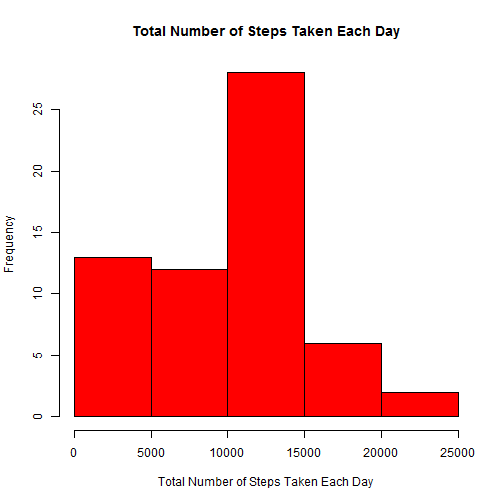
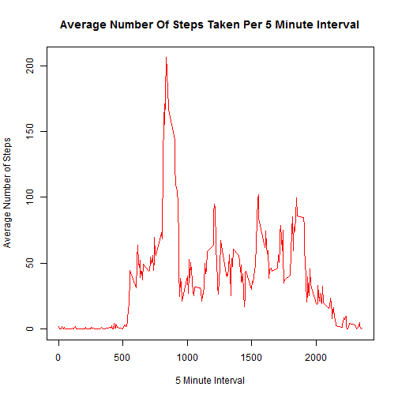
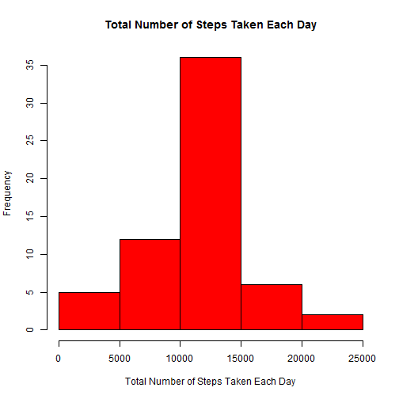

# Reproducible Research: Peer Assessment 1


## Loading and preprocessing the data


```r
activityUnZipped <- unzip("activity.zip")
activity <- read.csv("activity.csv")
activity$date <- as.Date(activity$date)
```


## What is mean total number of steps taken per day?


```r
totalStepsPerDay <- tapply(activity$steps, activity$date, sum, na.rm = TRUE)
hist(totalStepsPerDay, xlab = "Total Number of Steps Taken Each Day", main = "Total Number of Steps Taken Each Day", 
    col = "red")
```

 

Mean of total number of steps taken per day :

```r
mean(totalStepsPerDay)
```

```
## [1] 9354
```

Median of total number of steps taken per day :

```r
median(totalStepsPerDay)
```

```
## [1] 10395
```

## What is the average daily activity pattern?


```r
averageStepsPerFiveMinuteInterval <- tapply(activity$steps, activity$interval, 
    mean, na.rm = TRUE)
plot(averageStepsPerFiveMinuteInterval, x = rownames(averageStepsPerFiveMinuteInterval), 
    type = "l", col = "red", xlab = "5 Minute Interval", ylab = "Average Number of Steps", 
    main = "Average Number Of Steps Taken Per 5 Minute Interval")
```

 

The 5-minute interval that contains the maximum number of steps averaged across all the days in the dataset :

```r
rownames(averageStepsPerFiveMinuteInterval)[which.max(averageStepsPerFiveMinuteInterval)]
```

```
## [1] "835"
```


## Imputing missing values

The total number of missing values in the dataset :

```r
sum(is.na(activity))
```

```
## [1] 2304
```

The missing values in the dataset are replaced by the mean for the respective 5 minute interval.
A new dataset 'activityImputed' is created that is equal to the original dataset but with the missing data filled in.


```r
activityImputed <- activity

for (i in 1:nrow(activityImputed)) {
    if (is.na(activityImputed$steps[i])) {
        activityImputed$steps[i] <- averageStepsPerFiveMinuteInterval[rownames(averageStepsPerFiveMinuteInterval) == 
            activityImputed$interval[i]]
    }
}
```


```r
totalStepsTakenPerDay <- tapply(activityImputed$steps, activityImputed$date, 
    sum, na.rm = TRUE)
hist(totalStepsTakenPerDay, xlab = "Total Number of Steps Taken Each Day", main = "Total Number of Steps Taken Each Day", 
    col = "red")
```

 

Mean of total number of steps taken per day :

```r
mean(totalStepsTakenPerDay)
```

```
## [1] 10766
```

Median of total number of steps taken per day :

```r
median(totalStepsTakenPerDay)
```

```
## [1] 10766
```

These values differ from the estimates from the first part of the assignment. The imputing of missing data on the estimates of the total daily number of steps, increased the mean and the median. 

## Are there differences in activity patterns between weekdays and weekends?


```r
weekends <- c("Saturday", "Sunday")

for (i in 1:nrow(activityImputed)) {
    activityImputed$day[i] <- ifelse(weekdays(activityImputed$date[i]) %in% 
        weekends, "weekend", "weekday")
}

require(plyr)
```

```
## Loading required package: plyr
```

```
## Warning: package 'plyr' was built under R version 3.0.3
```

```r
activityByDay <- dlply(activityImputed, .(interval, day))

interval <- NULL
steps <- NULL
day <- NULL
for (i in 1:length(activityByDay)) {
    interval[i] <- activityByDay[[i]][[3]][1]
    steps[i] <- sum(activityByDay[[i]][1])/nrow(activityByDay[[i]])
    day[i] <- activityByDay[[i]][[4]][1]
}

activityByInterval <- cbind(interval, steps, day)

x <- as.numeric(activityByInterval[, "interval"])
y <- as.numeric(activityByInterval[, "steps"])
f <- factor(as.character(activityByInterval[, "day"]), labels = c("weekday", 
    "weekend"))

library(lattice)
```

```
## Warning: package 'lattice' was built under R version 3.0.3
```

```r

xyplot(y ~ x | f, layout = c(1, 2), type = "l", xlab = "Interval", ylab = "Number of Steps")
```

 


